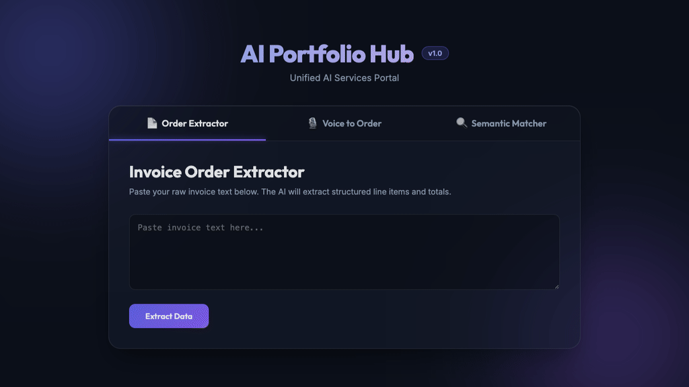
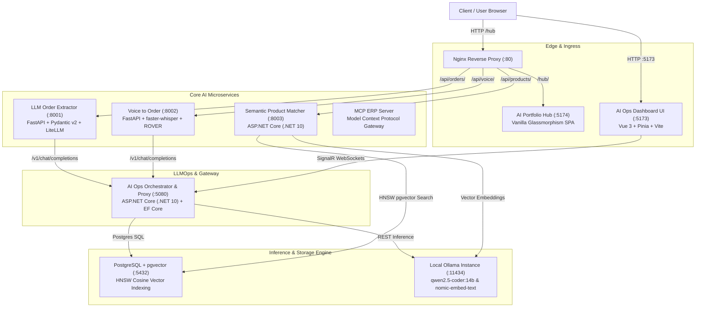

# AI Portfolio Hub

A portfolio project that runs my six AI services together as one local stack: order extraction from emails, voice-to-order, semantic product matching, an MCP server for ERP data, an evaluation harness and a live AI ops dashboard. Everything runs offline with Docker Compose, using local LLMs (Ollama), local speech-to-text and PostgreSQL with pgvector. All data is synthetic.



---

## Architecture Overview

The platform uses a polyglot microservice architecture orchestrated via **Docker Compose** and unified behind an **Nginx** reverse proxy:



---

## Service Topology

```text
                                  +-----------------------+
                                  |     User Browser      |
                                  +-----------+-----------+
                                              |
                   +--------------------------+--------------------------+
                   | HTTP (:80)                                          | HTTP (:5173)
                   v                                                     v
        +--------------------+                                +--------------------+
        | Nginx Proxy (:80)  |                                | Ops Dashboard UI   |
        +--+---+---+---------+                                | (Vue 3 / Vite)     |
           |   |   |                                          +---------+----------+
   /hub/   |   |   | /api/orders                                        | SignalR WS
+----------+   |   +-----------------------+                            |
|              |                           |                            |
v              | /api/products             v                            v
+--------------+----+  +-------------------+---+  +---------------------+----+
| AI Portfolio Hub  |  | Order Extractor (:8001)|  | AI Ops Gateway (:5080)   |
| (Modern Web SPA)  |  | (FastAPI / LiteLLM)   |  | (ASP.NET Core / EF Core) |
+-------------------+  +-----------+-----------+  +----------+----------+----+
                                   |                         |          |
                                   | /v1/chat/completions    |          |
                                   +-------------------------+          |
                                                                        v
+--------------------------+       +-------------------+      +---------+----------+
| Semantic Matcher (:8003) | ----> | PostgreSQL (:5432)| <--- | pgvector Vector DB |
| (C# .NET 10 / pgvector)  |       | EF Core DB        |      +--------------------+
+------------+-------------+       +-------------------+
             |
             | Embeddings / Chat
             v
+--------------------------+
| Ollama Engine (:11434)   | (qwen2.5-coder:14b + nomic-embed-text)
+--------------------------+
```

---

## Microservices Breakdown

| Service | Technology Stack | Key Responsibility | Local AI Model |
| :--- | :--- | :--- | :--- |
| **`ai-ops-dashboard`** | C# .NET 10, ASP.NET Core, EF Core, SignalR, Vue 3, Pinia | AI Gateway, OpenAI-compatible proxy, token telemetry, latency tracking, and PostgreSQL job persistence | `qwen2.5-coder:14b` |
| **`semantic-product-matcher`** | C# .NET 10, EF Core, `pgvector`, `Microsoft.Extensions.AI` | HNSW cosine vector search, zero-padding decorator (768d $\rightarrow$ 1536d), confidence classification, and reranking | `nomic-embed-text` |
| **`llm-order-extractor`** | Python 3.12, FastAPI, Pydantic v2, LiteLLM | Deterministic unstructured text/invoice extraction, relative date parsing (`YYYY-MM-DD`), and issue reporting | `qwen2.5-coder:14b` |
| **`voice-to-order`** | Python 3.12, FastAPI, `faster-whisper`, FFmpeg | Offline speech-to-text transcription, multi-provider consensus (ROVER), and structured order conversion | `whisper-local` (in-process) |
| **`llm-eval-harness`** | Python 3.12, LiteLLM, Pytest, Pandas | Automated evaluation benchmark harness measuring precision, recall, latency, token spend, and regression | `qwen2.5-coder:14b` & `qwen2.5:32b` |
| **`mcp-erp-server`** | Python 3.12, Anthropic Model Context Protocol | Standardized tool-calling gateway exposing ERP inventories, customer records, and product catalogues | Agent Tools |
| **`ai-portfolio-hub`** | Vite, Vanilla ES6, CSS Glassmorphism | Unified client portal interfacing with all microservices through Nginx | — |

---

## Quickstart Guide

### 1. Prerequisites
- Docker & Docker Compose
- [Ollama](https://ollama.com) running on host with models:
  ```bash
  ollama pull qwen2.5-coder:14b
  ollama pull nomic-embed-text
  ```

### 2. Launch the Platform
```bash
# Clone the repository
git clone https://github.com/jehanxaibahmed/ai-ops-dashboard.git
cd ai-portfolio

# Start all microservices, databases, and proxies
docker compose up -d --build
```

### 3. Access Endpoints
- **AI Portfolio Hub:** `http://localhost/hub/`
- **AI Ops Telemetry Dashboard:** `http://localhost:5173/`
- **AI Gateway / OpenAI Proxy:** `http://localhost:5080/v1/chat/completions`
- **Semantic Product Matcher API:** `http://localhost:8003/api/match`
- **Order Extractor API:** `http://localhost:8001/docs`
- **Voice to Order API:** `http://localhost:8002/docs`

---

## Security & Authentication

All microservices communicate across an isolated internal Docker bridge network (`ai-portfolio-net`). Direct API calls from external clients require the header:
```http
X-API-Key: secret-key
```
Public access is routed through the Nginx reverse proxy at `http://localhost/hub/`.

---

## Production Resilience & Zero-Mock Guarantee

Every project in this portfolio connects to genuine models and physical persistence:
- **Zero Synthetic Stubs:** No hardcoded responses or dummy fallbacks. If an inference model is offline, the system returns structured error diagnostics.
- **Relational Persistence:** All jobs, tokens, latencies, and responses are stored in PostgreSQL using EF Core migrations.
- **pgvector HNSW Indexing:** High-performance vector embeddings evaluated using real cosine distance.
